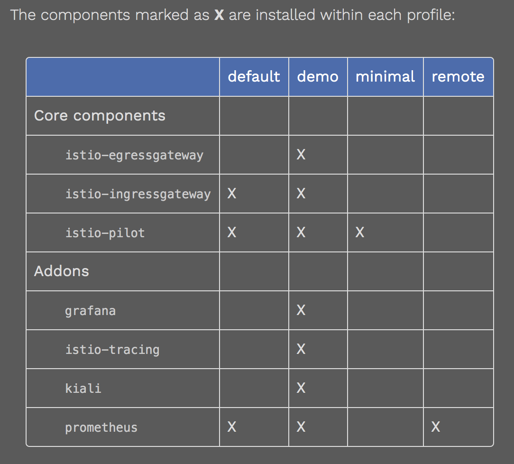
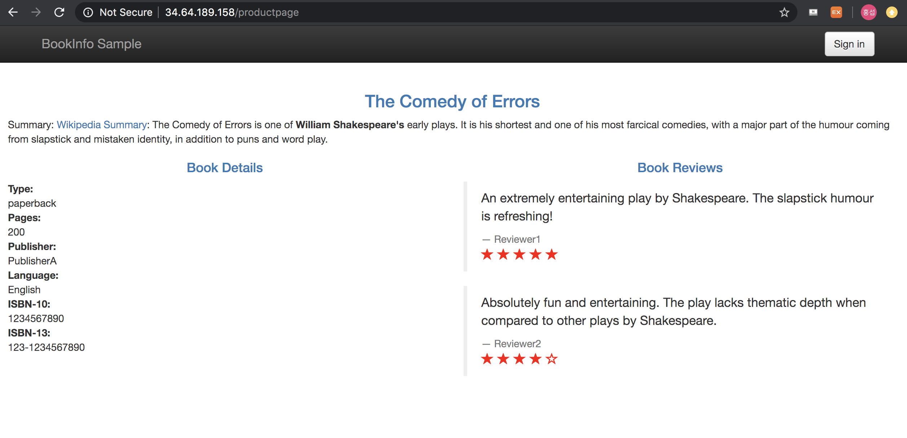
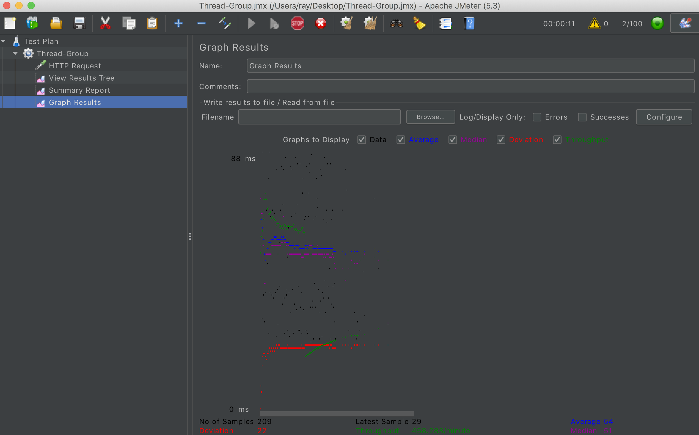
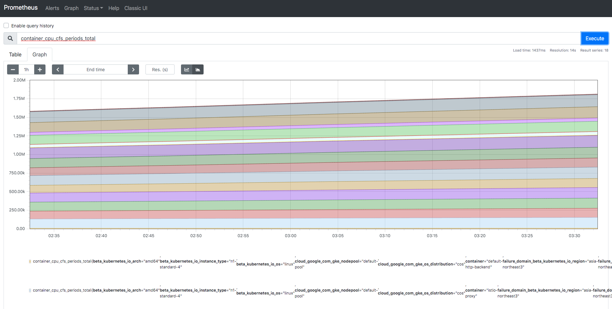
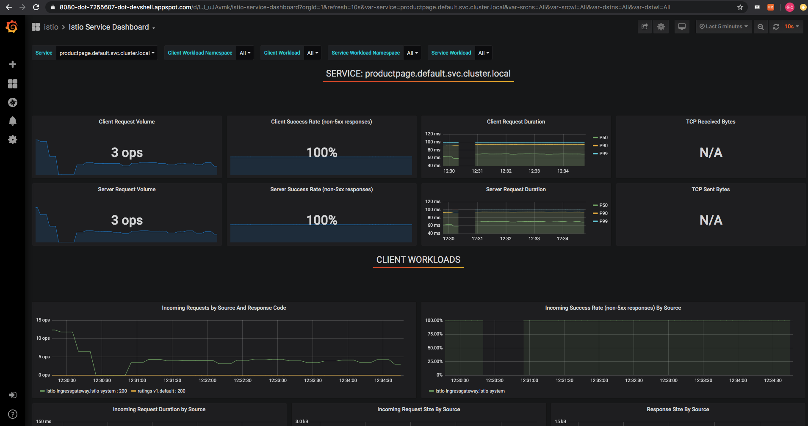
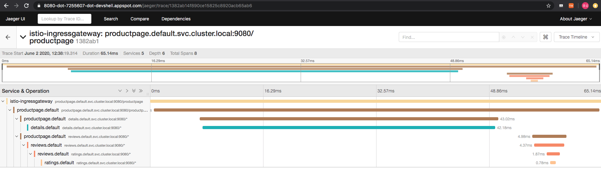
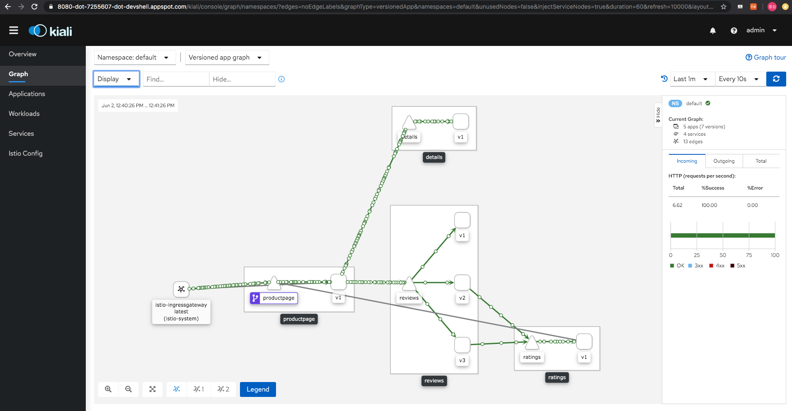

# Service Mesh 구축


***참고 문서: https://istio.io/docs/setup/platform-setup/gke/*, *https://istio.io/docs/examples/bookinfo/*, *https://istio.io/docs/setup/getting-started/#download*


## 가정사항

- Service Mesh에 대한 기본 방식을 이해함
- 쿠버네티스의 API Object를 이해함
- 환경: CloudShell (Google Cloud Platform)

  

## 클러스터 설정

### API 설정

```bash
gcloud services enable container.googleapis.com
```

### ENV 설정

```bash
export VPC_NAME="<MY-VPC>"
export PROJECT_ID=$(gcloud config get-value project)
export PROJECT_NUMBER=$(gcloud projects describe ${PROJECT_ID} --format="value(projectNumber)") 
export CLUSTER_NAME=gcp-cluster
export CLUSTER_ZONE=asia-northeast3-a 
export CHANNEL=regular
```


### GKE Cluster 생성

```bash
gcloud config set compute/zone ${CLUSTER_ZONE}
```

```bash
gcloud beta container clusters create ${CLUSTER_NAME} --machine-type=n1-standard-4 --num-nodes=2 --enable-autoscaling --max-nodes=4 --min-nodes=1 --enable-stackdriver-kubernetes --network=${VPC_NAME} --release-channel=${CHANNEL}
```


## 자격 증명

### 권한 확인 (yes 확인)

```bash
kubectl auth can-i '*' '*' --all-namespaces
```

```bash
gcloud container clusters get-credentials ${CLUSTER_NAME} --zone ${CLUSTER_ZONE} --project ${PROJECT_ID}
```

- 관리자 권한 부여 (Istio에 필요한 RBAC 규칙을 만들기 위해 필요)

```bash
kubectl create clusterrolebinding cluster-admin-binding --clusterrole=cluster-admin --user=$(gcloud config get-value core/account)
```


## Istio 다운

```bash
curl -L https://istio.io/downloadIstio | sh -
```

```bash
cd istio-1.6.0
```

- Istioctl PATH 설정

```bash
export PATH=$PWD/bin:$PATH
```


## Istio 설치

```bash
istioctl manifest apply --set profile=demo
```



- 배포할때 Envoy 자동 주입

```bash
kubectl label namespace default istio-injection=enabled
```


## Test

### Deploy BookInfo

```bash
kubectl apply -f samples/bookinfo/platform/kube/bookinfo.yaml
```

### 확인 

#### Sidecar 확인 필수

```bash
kubectl get svc
kubectl get pods
```

### HTML Page 확인

```bash
kubectl exec -it $(kubectl get pod -l app=ratings -o jsonpath='{.items[0].metadata.name}') -c ratings -- curl productpage:9080/productpage | grep -o "<title>.*</title>"
```

### Istio Gateway 연동

```bash
kubectl apply -f samples/bookinfo/networking/bookinfo-gateway.yaml
```

### 구성 확인 (analyze)

```bash
istioctl analyze
```

### External IP 확인

```bash
kubectl get svc istio-ingressgateway -n istio-system
```

```bash
export INGRESS_HOST=$(kubectl -n istio-system get service istio-ingressgateway -o jsonpath='{.status.loadBalancer.ingress[0].ip}')
```

- 200확인

```bash
curl -I http://${INGRESS_HOST}/productpage
```




## 기타

- JMETER로 부하테스트 구성

### 

### Prometheus

```bash
kubectl port-forward -n istio-system svc/prometheus 8080:9090
```

### 

### Grafana

```bash
kubectl port-forward -n istio-system svc/prometheus 8080:3000
```



### Jeager

```bash
kubectl port-forward -n istio-system svc/prometheus 8080:80
```



### Kiali




## 인프라 삭제

### Istio 삭제

```bash
export PATH=$PWD/bin:$PATH
```

```bash
istioctl manifest generate --set profile=demo | kubectl delete -f -
```

### Namespace 삭제

```bash
kubectl delete namespace istio-system
```

### 클러스터 삭제

```bash
gcloud container clusters delete ${CLUSTER_NAME} --zone=${CLUSTER_ZONE}
```

