# Anthos Service Mesh 구축


***참고 문서: https://cloud.google.com/service-mesh/docs/gke-install-new-cluster*


## 가정사항

- Service Mesh에 대한 기본 방식을 이해함
- Anthos API Enabled
- Anthos의 기본 구동 방식을 이해함
- 쿠버네티스의 API Object를 이해함
- 환경: CloudShell (Google Cloud Platform)
- 필요 역할 : Project Editor, Kubernetes Engine Admin, Project IAM Admin, GKE Hub Admin, Service Account Admin, Service Account key Admin (아닌 경우 소유자 Role이 필요함)


## 클러스터 설정

### API 설정

```bash
gcloud services enable container.googleapis.com compute.googleapis.com monitoring.googleapis.com logging.googleapis.com cloudtrace.googleapis.com meshca.googleapis.com meshtelemetry.googleapis.com meshconfig.googleapis.com iamcredentials.googleapis.com anthos.googleapis.com gkeconnect.googleapis.com gkehub.googleapis.com cloudresourcemanager.googleapis.com
```


### ENV 설정

```bash
export VPC_NAME="multi-vpc"
export PROJECT_ID=$(gcloud config get-value project)
export PROJECT_NUMBER=$(gcloud projects describe ${PROJECT_ID} --format="value(projectNumber)") 
export CLUSTER_NAME=gcp-cluster
export CLUSTER_ZONE=asia-northeast3-a 
export IDNS=${PROJECT_ID}.svc.id.goog 
export MESH_ID="proj-${PROJECT_NUMBER}"
export CHANNEL=regular
```

* IDNS: Workload Identity를 활성하는데 사용되며 이는 구글 클라우드 서비스에 안전하게 접근하기 위해 권장되는 방식
* MESH_ID: 클러스터에서 mesh_id 라벨 설정하는데 사용되고 이는 Anthos Service Mesh 대시보드에 지푤를 표시하는데 사용


### GKE Cluster 생성

```bash
gcloud config set compute/zone ${CLUSTER_ZONE}
```

```bash
gcloud beta container clusters create ${CLUSTER_NAME} --machine-type=n1-standard-4 --num-nodes=2 --enable-autoscaling --max-nodes=4 --min-nodes=1 --identity-namespace=${IDNS} --enable-stackdriver-kubernetes --network=${VPC_NAME} --labels mesh_id=${MESH_ID} --workload-pool=${IDNS} --release-channel=${CHANNEL}
```

- n1-standard-4 보다 낮은 사양으로 할 경우 추후 노드 cpu부족으로 진행되지 않음

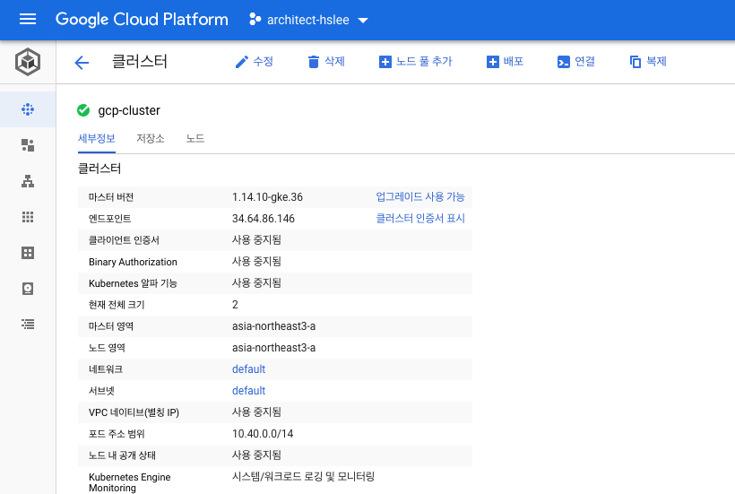


## 클러스터 등록 (Connect for Anthos)

### 권한 확인 (yes 확인)

```bash
kubectl auth can-i '*' '*' --all-namespaces
```


### 서비스 계정

#### 등록 (서비스 당 최소 권한 원칙)

```bash
export SERVICE_ACCOUNT=service-mesh-sa
```

```bash
gcloud iam service-accounts create ${SERVICE_ACCOUNT}
```

#### Role을 서비스 계정에 Binding

```bash
gcloud projects add-iam-policy-binding ${PROJECT_ID} --member="serviceAccount:${SERVICE_ACCOUNT}@${PROJECT_ID}.iam.gserviceaccount.com" --role="roles/gkehub.connect"
```

#### 서비스 계정 키 발급

```bash
export KEY=service-mesh-key.json
```

```bash
gcloud iam service-accounts keys create ${KEY} --iam-account=${SERVICE_ACCOUNT}@${PROJECT_ID}.iam.gserviceaccount.com
```

#### 클러스터 등록

```bash
gcloud container hub memberships register ${CLUSTER_NAME}-connect --gke-cluster=${CLUSTER_ZONE}/${CLUSTER_NAME} --service-account-key-file=./${KEY}
```


## Anthos Mesh 설치 및 구성

### 초기화

```bash
curl --request POST --header "Authorization: Bearer $(gcloud auth print-access-token)" --data '' https://meshconfig.googleapis.com/v1alpha1/projects/${PROJECT_ID}:initialize
```

*Response {}*

- 클러스터 관리자 권한 부여

```bash
gcloud container clusters get-credentials ${CLUSTER_NAME} --zone ${CLUSTER_ZONE}
```

```bash
kubectl create clusterrolebinding cluster-admin-binding --clusterrole=cluster-admin --user="$(gcloud config get-value core/account)"
```

*오류가 있는 경우에는 무시*


### Download Install File

- 정책 확인

```bash
gcloud projects get-iam-policy ${PROJECT_ID} | grep -B 1 'roles/meshdataplane.serviceAgent'
```

- Download

```bash
curl -LO https://storage.googleapis.com/gke-release/asm/istio-1.5.4-asm.2-linux.tar.gz
```

- Verified OK 확인

```bash
curl -LO https://storage.googleapis.com/gke-release/asm/istio-1.5.4-asm.2-linux.tar.gz.1.sig
openssl dgst -verify - -signature istio-1.5.4-asm.2-linux.tar.gz.1.sig istio-1.5.4-asm.2-linux.tar.gz <<'EOF'
-----BEGIN PUBLIC KEY-----
MFkwEwYHKoZIzj0CAQYIKoZIzj0DAQcDQgAEWZrGCUaJJr1H8a36sG4UUoXvlXvZ
wQfk16sxprI2gOJ2vFFggdq3ixF2h4qNBt0kI7ciDhgpwS8t+/960IsIgw==
-----END PUBLIC KEY-----
EOF
```

- 압축 해제

```bash
tar xzf istio-1.5.4-asm.2-linux.tar.gz
```

- 이동

```bash
cd istio-1.5.4-asm.2
```

- Path 설정

```bash
export PATH=$PWD/bin:$PATH
```


### kpt (쿠버네티스 구성파일의 저장소에서 쉽게 구성할 수 있는 Client 프로그램)

- kpt 설치

```bash
sudo apt-get install google-cloud-sdk-kpt
```

- Download

```bash
kpt pkg get https://github.com/GoogleCloudPlatform/anthos-service-mesh-packages.git/asm@release-1.5-asm .
```

- Setting

```bash
kpt cfg set asm gcloud.container.cluster ${CLUSTER_NAME}
kpt cfg set asm gcloud.core.project ${PROJECT_ID}
kpt cfg set asm gcloud.compute.location ${CLUSTER_ZONE}
```

*선택적으로 Resource Configuration 파일을 Cloud Source Repository와 같은 자체 소스 제어 시스템에 체크인 하여 변경 사항을 추적할 수 있음*

### Install Service Mesh

1. PERMISSIVE mTLS

```bash
istioctl manifest apply --set profile=asm --set values.prometheus.enabled=true --set values.grafana.enabled=true --set values.tracing.enabled=true --set values.global.proxy.tracer="stackdriver" -f asm/cluster/istio-operator.yaml
```

2. STRICT mTLS

```bash
istioctl manifest apply --set profile=asm --set values.prometheus.enabled=true --set values.grafana.enabled=true --set values.tracing.enabled=true --set values.global.proxy.tracer="stackdriver" -f asm/cluster/istio-operator.yaml --set values.global.mtls.enabled=true
```

*둘 중 하나 선택하여 구성*

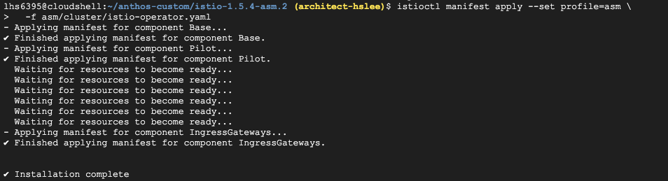 

- 확인

```bash
kubectl wait --for=condition=available --timeout=600s deployment --all -n istio-system
```

```bash
kubectl get pod -n istio-system
```

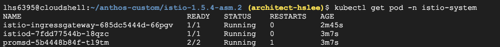

- 유효성 확인

1. 애플리케이션 기본 자격 증명

```bash
gcloud auth application-default login
```

2. 크리덴셜 인증

```bash
gcloud container clusters get-credentials ${CLUSTER_NAME} --zone ${CLUSTER_ZONE}
```

3. Anthos Service Mesh 유효성 검사

```bash
asmctl validate --with-testing-workloads
```

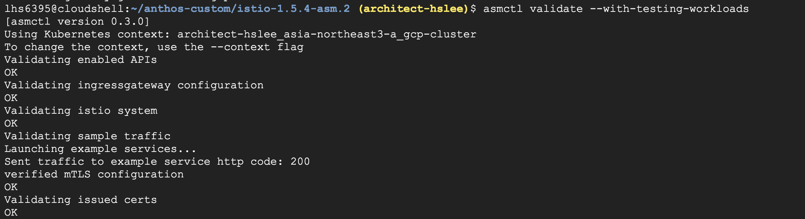

### Sidecar Proxy 주입

- namespace가 default로 할 경우는 애플리케이션에 대한 namespace를 지정하지 않은 경우임

```bash
kubectl label namespace default(Namespce) istio-injection=enabled --overwrite
```


## Test

### BookInfo Sample

```bash
kubectl apply -f samples/bookinfo/platform/kube/bookinfo.yaml
```


### Ingress Gateway

```bash
kubectl apply -f samples/bookinfo/networking/bookinfo-gateway.yaml
```


### SVC, Pod 확인

```bash
kubectl get pods
kubectl get svc
```

### 동작 확인

```bash
kubectl exec -it $(kubectl get pod -l app=ratings -o jsonpath='{.items[0].metadata.name}') -c ratings -- curl productpage:9080/productpage | grep -o "<title>.*</title>"
```

### IP 확인

```bash
kubectl get svc istio-ingressgateway -n istio-system
```

### BookInfo Result

```text
bookinfo-external-ip/productpage
```

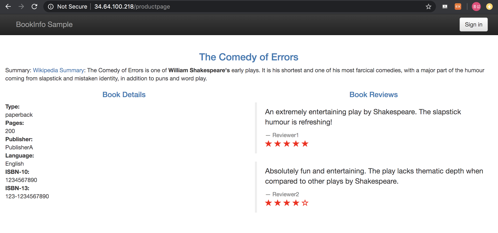


## 기타

### 참고 사항

#### Jmeter로 부하테스트 생성

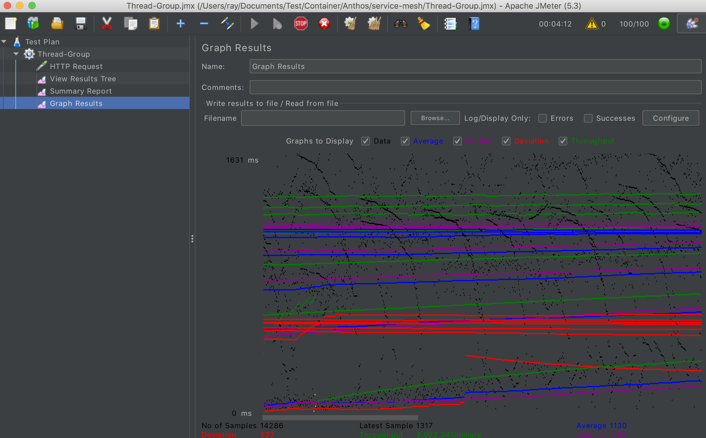

### 서비스 확인

```bash
kubectl get svc -n -istio-system
```

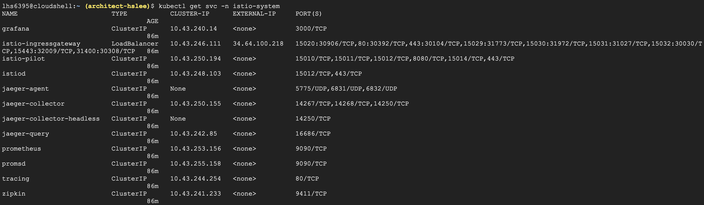

### Prometheus

```bash
kubectl port-forward svc/prometheus -n istio-system 8080:9090
```

*웹 미리보기로 localhost:8080로 접속*

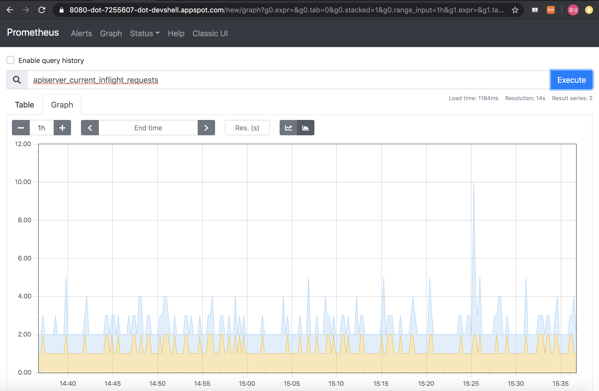

### Grafana

```bash
kubectl port-forward svc/grafana -n istio-system 8080:3000
```

*웹 미리보기로 localhost:8080로 접속*

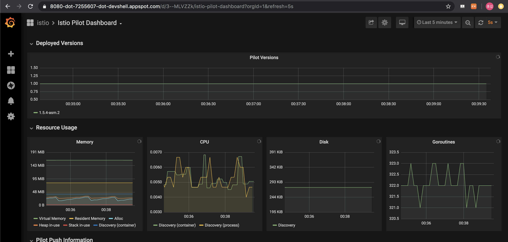

### Jaeger

```bash
kubectl port-forward svc/tracing -n istio-system 8080:80
```

*웹 미리보기로 localhost:8080로 접속*

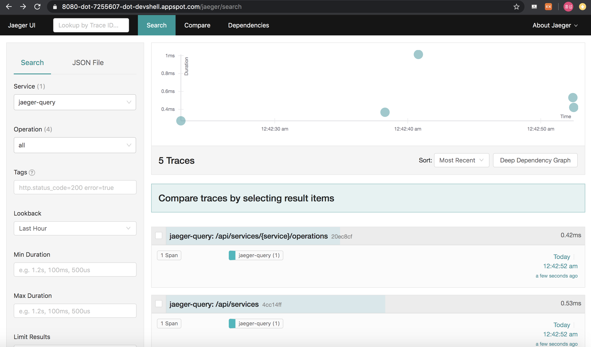

### Anthos Service Mesh

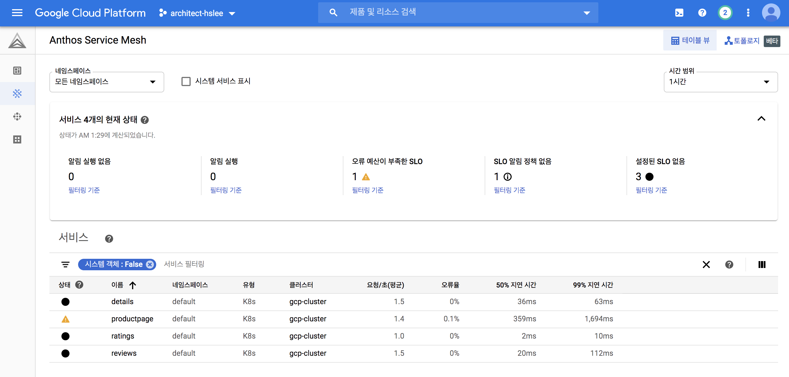

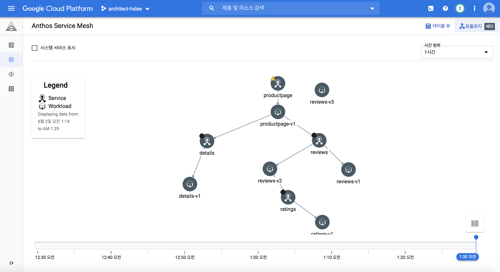

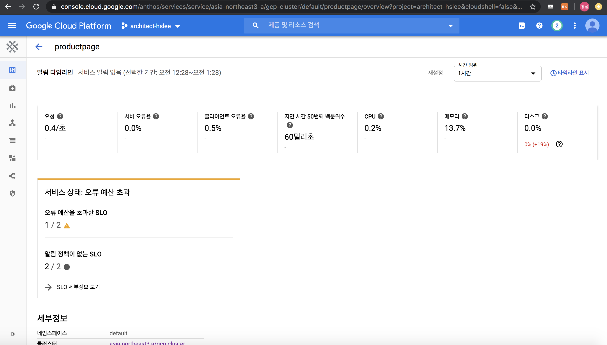

